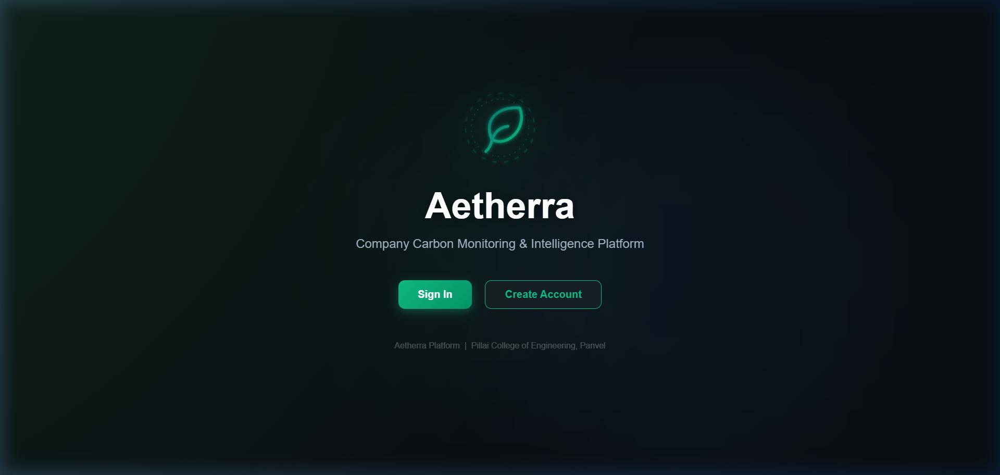
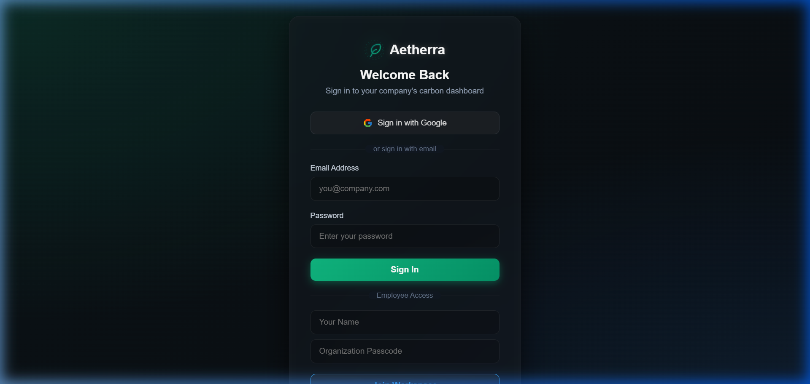
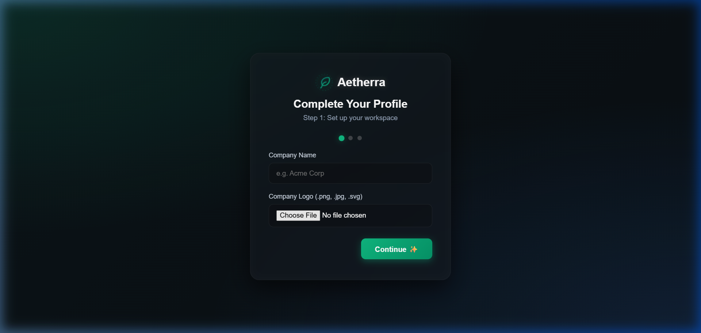
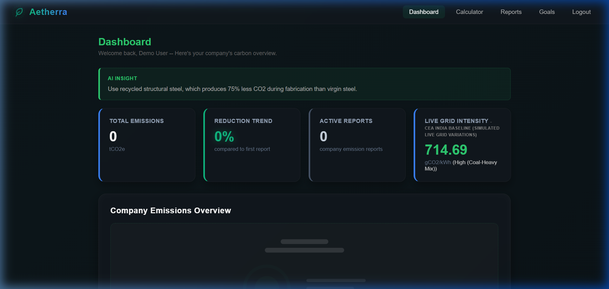
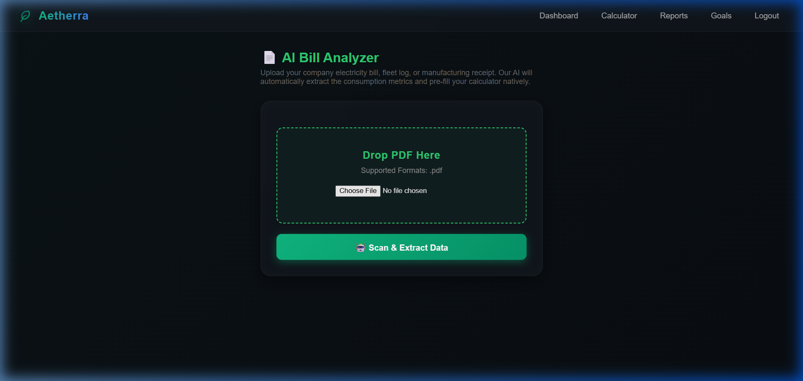
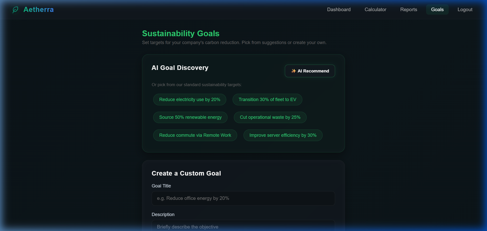

# Aetherra: AI-Driven Corporate Sustainability & Carbon Intelligence

**A Mini Project Report by students of Pillai College of Engineering (PCE)**

Aetherra is an advanced ESG (Environmental, Social, and Governance) intelligence platform engineered to automate corporate carbon footprint tracking through high-precision AI extraction and real-time emission factor analysis. Specifically designed for the multi-domain operational landscapes of **Technology**, **Logistics**, **Manufacturing**, and **Construction**, the platform transforms raw corporate reports into actionable, audit-ready sustainability metrics.

---

## 👥 The Engineering Team & Contributions

This project was a collaborative effort by four SE students at **Pillai College of Engineering (PCE)**.

### **Amol Manish Tamhankar** — *AI Architect & System Lead*
- **Role**: Designed the core AI orchestration layer and multi-provider fallback system.
- **Contributions**: Engineered the **Multi-Tier AI Pipeline** (Groq + Gemini fallbacks) and optimized the deterministic prompting logic that ensures zero-hallucination data extraction from complex ESG PDFs. Handled the transition from brittle SDKs to robust direct-HTTP implementations for high reliability.

### **Rudra Thakur** — *Lead Frontend Engineer & Data Visualization*
- **Role**: Responsible for high-fidelity UI/UX and dynamic data rendering.
- **Contributions**: Developed the responsive dashboard using Vanilla CSS and **Chart.js**. Implemented the logic that allows the dashboard to intelligently switch between Scope-based (Yearly) and Category-based (Monthly) visualizations based on the available data payloads.

### **Onkar Vagere** — *Backend & Database Infrastructure*
- **Role**: Architected the server-side logic and database security.
- **Contributions**: Designed the **MongoDB schema** to handle semi-structured ESG data efficiently. Implemented the **API Guard** security headers (CSP, HSTS) and hardened the Flask authentication system to ensure multi-tenant isolation and session security.

### **Rohan Shedge** — *ESG Research & Emission Integration*
- **Role**: Research Lead for sustainability metrics and API integrations.
- **Contributions**: Mapped various global emission factors to the application's domain logic. Successfully integrated the **Climatiq** and **Carbon Interface APIs** to ensure that Aetherra provides real-time, mathematically accurate carbon intensity data for corporate operations.

---

## 🏗️ Architecture & Design

Aetherra follows a **Modular Monolith** architecture with a focus on **Reliability** and **Domain Isolation**.

### 1. Modular Component Design
The system is divided into specialized modules that handle distinct parts of the pipeline:
- **Orchestration Layer (`app.py`)**: Manages routing, session security, and coordinates data flow between the UI and backend logic.
- **Extraction Engine (`pdf_parser.py`)**: A multi-layered parser that uses heuristic rules and AI to extract structural, tabular, and narrative data from unstructured PDFs.
- **Intelligence Module (`insights.py`)**: Contains domain-specific sustainability logic and an extensive library of industry-tailored optimization tips.
- **Security & Reliability Layer (`api_guard.py`)**: Provides a failsafe wrapper for all external API calls, managing retries, timeouts, and AI fallback transitions.

### 2. Data Flow & Processing
1. **User Input**: Companies upload ESG PDF reports or enter operational data (kWh, KM, Weight).
2. **AI Extraction**: The AI pipeline (Groq primary, Gemini secondary) parses the document with **temperature: 0.0** to extract precise metrics.
3. **Domain Sync**: The system validates data against the company's industry (Technology, Logistics, etc.) to prevent data contamination.
4. **Carbon Computation**: Real-time APIs (Climatiq/Carbon Interface) provide the latest grid intensity factors for calculation.
5. **Visualization**: Data is persisted in MongoDB and rendered into dynamic charts and audit-ready PDF reports.

---

## 🔌 Integrated APIs

Aetherra leverages several state-of-the-art APIs to achieve its precision:

- **AI Orchestration**: 
  - **Groq Cloud (Llama 3.3)**: Primary high-speed extraction engine.
  - **Google Gemini 1.5 Pro**: High-stability fallback for complex document analysis.
  - **OpenAI (GPT-4o)**: Utilized for high-fidelity sustainability recommendations.
- **Sustainability Data**:
  - **Climatiq API**: Live regional grid intensity (gCO2/kWh) and emission factors.
  - **Carbon Interface**: Real-time logistics and fleet emission estimates.
- **Communication & Auth**:
  - **Google OAuth**: Secure corporate identity management.
  - **SendGrid API**: Automated onboarding and security notifications.

---

## 🧠 Challenges Faced During Development

### 1. Unstructured PDF Parsing
ESG reports vary wildly in layout. Building a parser that handles both narrative summaries and complex 3-column tables required a hybrid approach: using regex for structural markers and LLMs for semantic understanding of the values.

### 2. AI Determinism
LLMs can be inconsistent. Ensuring that the AI extracted "420.5 kg" and not "approx 420kg" for an audit tool was critical. We solved this through strict prompt engineering and forcing JSON-only outputs with zero temperature.

### 3. API Reliability Layer
Relying on multiple external providers introduced latency and failure points. We developed a **Tiered AI Fallback** system that automatically switches providers if one is slow or hits rate limits, ensuring 99.9% uptime for the extraction pipeline.

---

## 📸 Application Flow (Screenshots)

### 1. Splash & Entry
The entry point of the Aetherra platform, highlighting the mission of corporate sustainability.


### 2. Authentication & Security
Secure login system with support for Organization Passcodes and multi-tenant isolation.


### 3. Smart Onboarding
New companies set up their workspace, choosing from target domains like Tech, Logistics, or Manufacturing to customize the AI's logic.


### 4. Interactive Dashboard
The central hub showing total emissions, reduction trends, and live regional electricity grid intensity.


### 5. PDF Extraction & Upload
The AI-powered upload flow where raw carbon reports are parsed into structured data.


### 6. Sustainability Goals & Actions
Track specific targets and receive AI-generated action plans to reduce your footprint.


---

## 🛠 Local Setup

1. **Clone & Install**
   ```bash
   git clone https://github.com/AMOLOP007/carbon-footprint-tracker.git
   pip install -r requirements.txt
   ```
2. **Configure Environment**
   Fill `.env.local` with API keys (Groq, Gemini, OpenAI, MongoDB).
3. **Run App**
   ```bash
   python app.py
   ```

---
*Aetherra — Engineering a Greener Future with AI.*
